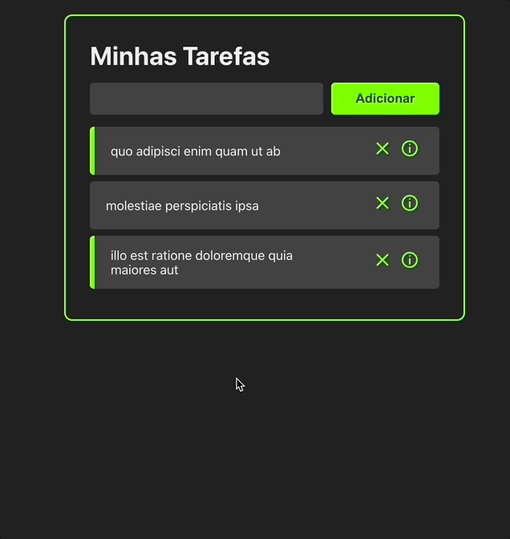

# App Simples de Lista

Aplicação feita em React seguindo o tutorial no <a href="https://www.youtube.com/watch?v=ErjWNvP6mko">youtube</a>, de Felipe Rocha.

## Tecnologias utilizadas:
- [x] React
## Iniando o ambiente de desenvolvimento:
1. Clone o repositório `git clone https://github.com/joaoaafn/react-basic-todo-list.git`. 
1. Rode `npm install` ou `yarn install`. 
2. Rode `npm start`. 

## Demo
<h1 align="center"></h1>
